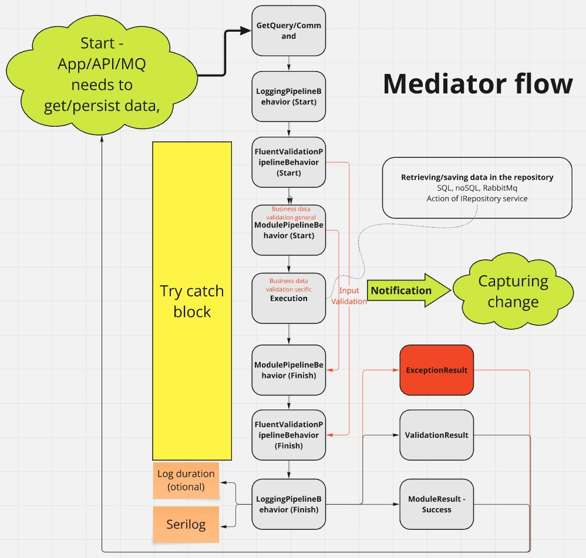

# About solutions
POC for .NET 8 - Clean architecture and not ready for production !!! This is a "private" project and some parts/ideas of the code may be ported to productions in other projects.
Inspired by [Milan Jovanović](https://www.youtube.com/@MilanJovanovicTech)

Key architecture design pattern - [Mediator](https://refactoring.guru/design-patterns/mediator)

## General concept

## Unit/Integration Tests
It needs Docker -> [docker-compose.yaml](https://github.com/MachacekJ/ACore/blob/main/ACore/test/ACore.Tests/Docker/ACore/docker-compose.yaml)

## Modules

