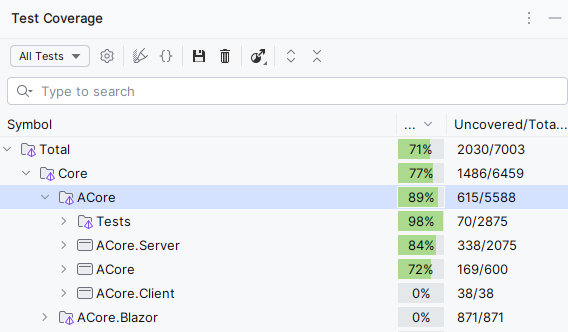

# About solutions
POC for .NET 8 - Clean architecture and not ready for production !!! This is a "private" project and some parts/ideas of the code may be ported to productions in other projects.
Inspired by [Milan Jovanović](https://www.youtube.com/@MilanJovanovicTech)

Key architecture design pattern - [Mediator](https://refactoring.guru/design-patterns/mediator)

## Technologies
### Backend
- .NET 9
- Postgres, MongoDB (MSSQL ready to implementation)
- Blazor App
- EntityFramework
- MediatR
- Autofac
    - mainly for registration open generic type for MediatR -> IRequest,
- Logging - Serilog
- Aspire

### Frontend
- Blazor App
- fully responsive
- SCSS
- Telerik
- Localization
- Logging
    - via MediatR - in memory
    - TODO - send log information to Server

### Testing
- Unit tests and Integration tests are included
- xUnit
- Moq
- BUnit
- Selenium for E2E testing
- It needs Docker -> [docker-compose.yaml](https://github.com/MachacekJ/ACore/blob/main/Aspire/Docker/docker-compose.yaml)
  

### TODO to be production ready:
- Better code comments
- Better documentation
- UML diagrams
- tests, only ACode has a code coverage of xUnit of around 70%.
- Stress tests

## General concept

### Project/Microservice
- The first line is YARP to distribute the request to the infrastructure
- Second line is microservices - they consume and resolve requests, send the response to YARP.
- The third line is the modules that are part of the project

### Modules
Pieces of **independent** code that have their own configuration, storage services, communication interfaces. To use Postgres and MongoDB repositories, the repository service can use write and read mode. Postgres and MongoDB repositories are replicated.

- SettingsDbModule
- AuditModule
- LocalizationModule
- SecurityModule

### Communication
- Minimal API
- RabbitMQ

### Databases
DATABASE FIRST approach - modification scripts are included in module

- Postgres (primary and replicated)
- MongoDB
- Redis
Not implemented
- MSSQL and other - can be included, infrastructure is ready

## Unit/Integration Tests

## Modules

## How to try it

